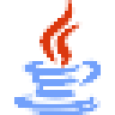

  
  <h2>𝙿 𝚁 𝙾 𝙹 𝙴 𝙲 𝚃 𝚂</h2>

  <table align="center" style="border-collapse: collapse; border: none;">
    <tr>
      <td align="center" style="padding: 20px; border: none;">
        <a href="https://github.com/aaarthurr">
           
          
Portfolio

        </a>
      </td>
      <td align="center" style="padding: 20px; border: none;">
        <a href="https://github.com/aaarthurr">
           
          
ft_transcendence

        </a>
      </td>
      <td align="center" style="padding: 20px; border: none;">
        <a href="https://github.com/aaarthurr">
           
          
Cursus

        </a>
      </td>
      <td align="center" style="padding: 20px; border: none;">
        <a href="https://github.com/aaarthurr">
           
          
DAFT

        </a>
      </td>
      <td align="center" style="padding: 20px; border: none;">
        <a href="https://github.com/aaarthurr">
           
          
cub3d

        </a>
      </td>
    </tr>
  </table>

  <h2>𝚂 𝙺 𝙸 𝙻 𝙻 𝚂</h2>
  <h3>languages</h3>
  
  
  
  

  <h3>others</h3>

  
  
  
  
  
  
  
  
  
  
  
  
  
  
  
  

  <h2>𝚂 𝚃 𝙰 𝚃 𝚂</h2>
  
  
  
  <h2>𝙼 𝙾 𝚁 𝙴</h2>
  
  
  [LinkedIn](https://fr.linkedin.com/in/arthur-pag%C3%A8s-18029629a)  
  [Portfolio](https://www.arpages.fr)  
  [email](arthur.pagesw@gmail.com)  
    
  𝐀𝐫𝐭𝐡𝐮𝐫 𝐏𝐚𝐠𝐞𝐬  
  𝐅𝐫𝐚𝐧𝐜𝐞 

